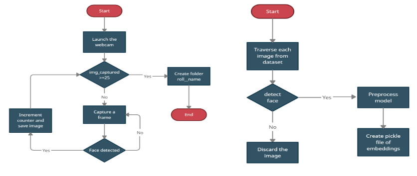

# Automated Attendance System Using Machine Learning

##  Project Overview
Traditional attendance systems—manual calling or fingerprint scanners—are often time-consuming, prone to proxy attendance, and involve physical contact. This project proposes an **Automated Attendance System** that utilizes Deep Learning and Face Recognition to provide a contactless, secure, and efficient solution for institutional and corporate environments.

### Key Objectives:
* **Eliminate Manual Error:** Reduce the risk of "proxy" attendance.
* **Contactless Operation:** Safer alternative to biometric scanners.
* **Real-time Processing:** Capable of identifying multiple faces in a single frame using medium-resolution cameras.

---

## System Thinking & Pipeline
The project follows a modular "detect-to-classify" pipeline, transforming raw pixels into verified identity logs.

### 1. Face Detection & ROI Extraction
The system captures video feed and isolates human faces using:
* **Haar Cascade Classifiers:** Uses pixel-square analysis to detect features rapidly.
* **R-CNN (Region-based CNN):** Extracts high-accuracy regions of interest (ROI) for complex environments.

### 2. Facial Landmark Alignment
To handle head tilts and rotations:
* **68-Point Landmark Model:** Identifies unique facial structures.
* **Affine Transformation:** Normalizes and centers the face to ensure a "front-facing" view for consistent feature extraction.

### 3. Face Encoding (FaceNet Architecture)
The "brain" of the system translates visual features into mathematical data:
* **128-Element Vector:** Every face is compressed into a unique embedding (vector).
* **Triplet Loss Learning:** Ensures that different images of the same person are mathematically close, while images of different people are far apart.

### 4. Classification & Logging
* **SVM (Support Vector Machine):** A trained classifier maps the 128-d vector to a specific identity in the database.
* **Automated Database Entry:** Once recognized, the system automatically logs the name and timestamp into the attendance record.
  

---

## Tech Stack
* **Language:** Python
* **Libraries:** OpenCV, Dlib, Keras, TensorFlow
* **Algorithms:** FaceNet, SVM, Haar Cascade
* **Hardware:** Medium-resolution Camera, NVIDIA 1050Ti GPU (for training)

---

##  Key Features
* **High Accuracy:** Leverages FaceNet's state-of-the-art embedding logic.
* **Scalable:** Designed to work on standard hardware and adaptable for IoT deployment.
* **Safety-First:** Ideal for post-pandemic environments where physical contact should be minimized.

---

##  Future Scope
* **Online Training:** Implementing runtime retraining to improve accuracy as more data is collected.
* **Mobile Integration:** Transitioning the system to low-capacity mobile and IoT devices.
* **Liveness Detection:** Adding anti-spoofing measures to prevent the system from being fooled by photos.

---
## 👥 Contributors
* **Atharva Deshpande**
* **Jyotshna Dammu**
* **Pranav Kulkarni**
* **Guide:** Dr. M.V. Munot
---
*Developed at Pune Institute of Computer Technology (PICT), India.*
