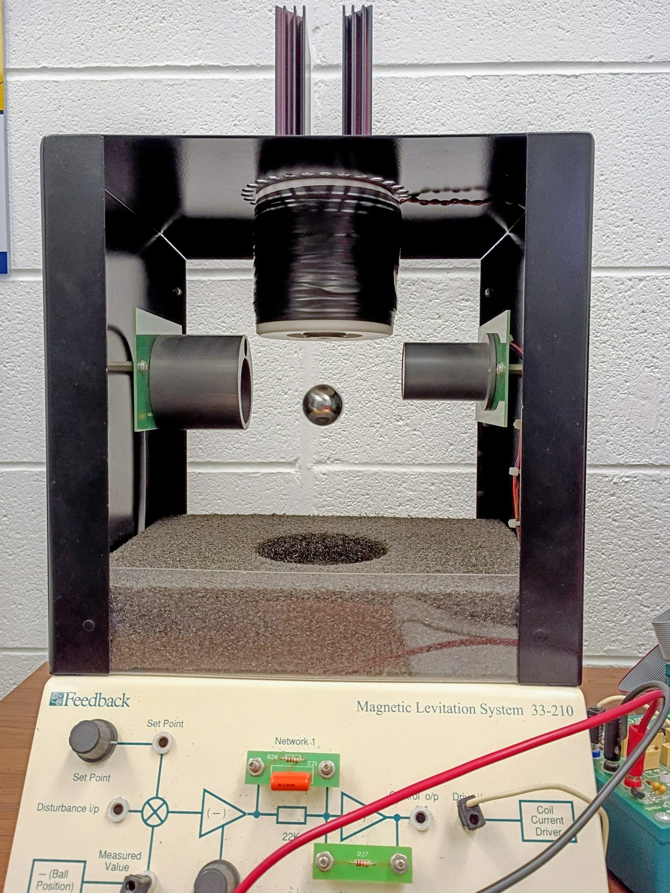
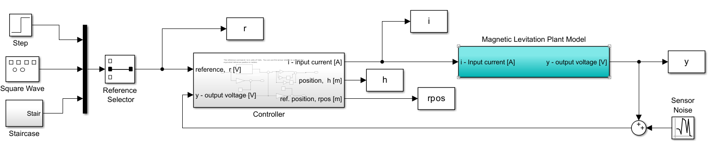
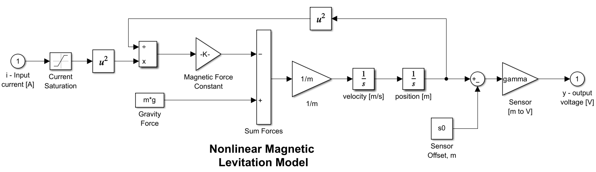

# Magnetic Levitation Control System

## Overview

This project focuses on the **modeling, control design, simulation, and hardware implementation** of a **magnetic ball levitation (Maglev) system**. The objective is to stabilize and precisely control the vertical position of a steel ball using electromagnetic force in the presence of **nonlinear dynamics and open-loop instability**.

The project was completed as part of **Control Systems Laboratory** at the **University of Michigan** and emphasizes the full workflow from **analytical modeling → controller design → nonlinear simulation → real-time hardware experimentation**.

---

## System Description

The goal is to levitate the ball at a desired height and track reference changes while respecting actuator limits.

The Maglev setup consists of:
* An **electromagnet** driven by coil current ( i(t) )
* A **steel ball** with vertical position ( h(t) )
* An **infrared position sensor** providing voltage output ( y(t) )

---

## Nonlinear Plant Model

The vertical dynamics of the ball are governed by:

$$m_b \ddot{h}(t) = m_b g - \frac{\alpha i(t)^2}{h(t)^2}$$

Where:

* $m_b = 0.02$ **kg**
* $g = 9.81$ **m/s²**
* $\alpha = 2.4832 \times 10^{-5}$ **Nm²/A²**

**Sensor model:**

$$y = \gamma (h - s_0), \quad \gamma = 143.48 \text{ V/m}$$

## Control Objectives

* Stabilize an **open-loop unstable nonlinear system**
* Track height references with:

  * Zero steady-state error
  * Settling time ≈ **3 s**
  * Overshoot ≤ **10%**
* Maintain actuator current within **±5 A**
* Achieve robustness to disturbances, noise, and modeling uncertainty

---

## Control Architecture

The controller is implemented in **discrete time (Δt = 1 ms)** and consists of:

* A **PID feedback controller** for stabilization
* A **reference pre-compensator (2-DOF control)** for overshoot reduction

### Equilibrium & Linearization

* **Selected equilibrium height:** $$\bar{h} = 0.009 \text{ m}$$
* **Computed equilibrium current** ($\bar{i}$) and **sensor output** ($\bar{y}$)
* **Linearized the nonlinear model** about $(\bar{i}, \bar{h})$

**Key properties of the linearized plant $G(s)$:**
* **Unstable pole:** $\approx 46.7 \text{ rad/s}$
* **DC gain:** $G(0) = 1.614$

---

### PID Controller Design (1-DOF)

A **PID controller** was designed to stabilize the unstable plant. Gains were constrained by hardware limitations:

$$|K_p|, |K_i|, |K_d| \leq 4.5$$

**Design Strategy:**
* **Dominant slow pole** to meet settling time requirements.
* **Two faster poles** for improved transient response.
* Studied sensitivity of response to individual gain variations.

---

### Reference Shaping (2-DOF Control)

To reduce overshoot and large control transients, a **reference pre-compensator** was introduced:

$$F(s) = \frac{K_i}{K_d s^2 + K_p s + K_i}$$

### Purpose

* Cancels the controller zeros responsible for overshoot
* Smooths reference commands without affecting steady-state tracking
* Significantly reduces actuator saturation

---

## Stability Margins

Robustness was assessed using the loop transfer function:
[
L(s) = G(s)K(s)
]

Achieved:

* Gain margin ≥ **6 dB**
* Phase margin ≥ **45°**

Ensures stability under model mismatch and unmodeled dynamics.

---

## Simulation Results

### Linear Simulations

* Step reference corresponding to **1 cm height change**
* Compared 1‑DOF and 2‑DOF architectures
* Evaluated overshoot, settling time, and control effort

### Nonlinear Simulations

Simulations included:

* Sensor noise
* Actuator saturation
* Discrete-time implementation

Reference inputs tested:

* Step inputs of increasing magnitude
* Square wave
* Staircase waveform

---

## Hardware Implementation & Experiments

The final controller was deployed on the **physical Maglev system**.

### Experiments Conducted

1. **Stability Test** – Verified levitation from manual placement
2. **Step Response** – Gradually increased step size
3. **Disturbance Rejection** – Applied external disturbances by hand
4. **Staircase Tracking** – Tracked multi-level reference inputs
5. **Square Wave Tracking** – Increased amplitude at fixed frequency

Additional considerations:

* Integrator anti-windup via delayed activation
* Explicit handling of current saturation

---

## Key Results

* Successfully stabilized an unstable nonlinear plant
* Achieved reliable tracking for reference steps ≥ **1 V**
* Strong disturbance rejection
* Close agreement between simulation and experimental results
* Reference shaping significantly improved transient behavior

---

## Tools & Technologies

* MATLAB / Simulink
* Control system modeling and linearization
* Discrete-time PID control
* Nonlinear simulation
* Real-time hardware experimentation

---
