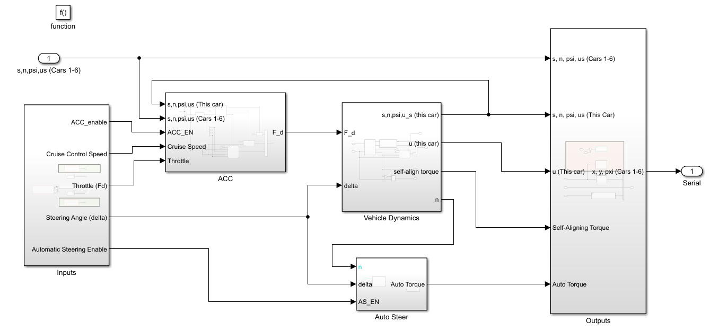

# Adaptive Cruise Control with Automatic Steering (Haptic Interface)

## Overview
This project focuses on the development of a **Simulink-based Adaptive Cruise Control (ACC) system with integrated automatic steering**, designed for deployment on an **NXP S32K144 microcontroller (MCU)**. The system enables safe longitudinal and lateral vehicle control using real-time vehicle-to-vehicle communication over CAN.

The vehicle operates in **manual**, **speed control**, or **position control** modes, automatically switching based on traffic conditions to maintain a safe following distance. A **haptic steering wheel** is used as the steering interface, providing both driver input and force feedback for realism.

---

## System Features
- Longitudinal ACC with speed and position control
- Automatic steering using cascaded PD control
- Manual control via potentiometer
- CAN-based multi-vehicle traffic simulation (up to 6 vehicles)
- Hardware interfacing with GPIO, ADC, FlexTimer, and CAN
- Deployable Simulink model for embedded target (S32K144)

---

## System Architecture

Key components include:
- Differential equation–based vehicle motion model
- ACC decision logic
- Lead vehicle identification
- Automatic steering controller
- Embedded hardware I/O and CAN communication

---

## Adaptive Cruise Control Logic

### ACC Modes
The system supports three operating modes:
- **Manual Mode**: Vehicle speed controlled using a potentiometer
- **Speed Control Mode**: ACC maintains driver-set speed
- **Position Control Mode**: ACC maintains a safe distance from the lead vehicle

The ACC system automatically switches between **speed** and **position** control based on the proximity of the lead vehicle.

---

## Lead Vehicle Identification (Pick Lead Logic)

The lead vehicle is identified using position data received via CAN.

Definitions:
- `s` : longitudinal position of our vehicle
- `s_i` : longitudinal positions of other vehicles

Algorithm:
1. Compute Δs = s_i − s for all vehicles
2. Identify the **minimum positive Δs**
3. Select the corresponding vehicle as the **lead vehicle**
4. Extract lead vehicle speed and position

Vehicle position and speed data are received as arrays through CAN communication.

---

## Mode Switching Logic
- If a lead vehicle exists and the distance is **less than the safe gap (H)** → **Position Control**
- Otherwise → **Speed Control**
- Manual mode overrides ACC when ACC is disabled

To avoid oscillations between speed and position control:
- The system switches back to speed control **only if the speed difference between vehicles exceeds a small positive threshold**

---

## Automatic Steering Control

The automatic steering controller ensures accurate lateral path tracking.

### Inputs
- Enable command
- Desired lateral displacement (`n_des`)
- Actual lateral displacement (`n`)
- Steering angle (`δ`)

### Control Structure
- A **discrete-time PD controller** generates a reference steering angle
- A **discrete-time PID controller** computes the steering torque based on the error between reference angle and actual steering angle

### Controller Tuning Guidelines
- Increase **Kp** if response is underdamped
- Decrease **Kp** if oscillations are unstable
- Increase **Kd** if oscillations are large and slow to decay
- **Ki** is kept very small

---

## Embedded Implementation
- Vehicle speed controlled via:
  - Potentiometer (manual mode)
  - GPIO inputs (ACC speed setting)
- ACC logic implemented using:
  - Enabled subsystems or Stateflow
  - Simulink `Merge` blocks to select active control output
- All control modes output a driving force applied to the front wheels

---

## CAN Communication

In a real ACC system, radar sensors measure surrounding traffic. In this project, **CAN communication replaces radar** to share vehicle states among multiple simulated vehicles.

### Transmitted Data
Each vehicle periodically transmits two CAN messages:

| Message | Bytes | Data |
|-------|-------|------|
| Message 1 | 1–4 | Longitudinal position `s` (float) |
|          | 5–8 | Lateral position `n` (float) |
| Message 2 | 1–4 | Speed `u_s` (float) |
|          | 5–8 | Steering angle `δ` (float, radians) |

### Encoding & Decoding
- `Single-to-Bytes` blocks used for CAN transmission
- Received messages are unpacked using:
  - Byte demuxing
  - `Bytes-to-Single` blocks to reconstruct floating-point values

---

## Tools & Technologies
- MATLAB & Simulink
- NXP S32K144 MCU
- CAN communication
- Embedded peripherals: GPIO, ADC, FlexTimer
- Stateflow / Enabled Subsystems
